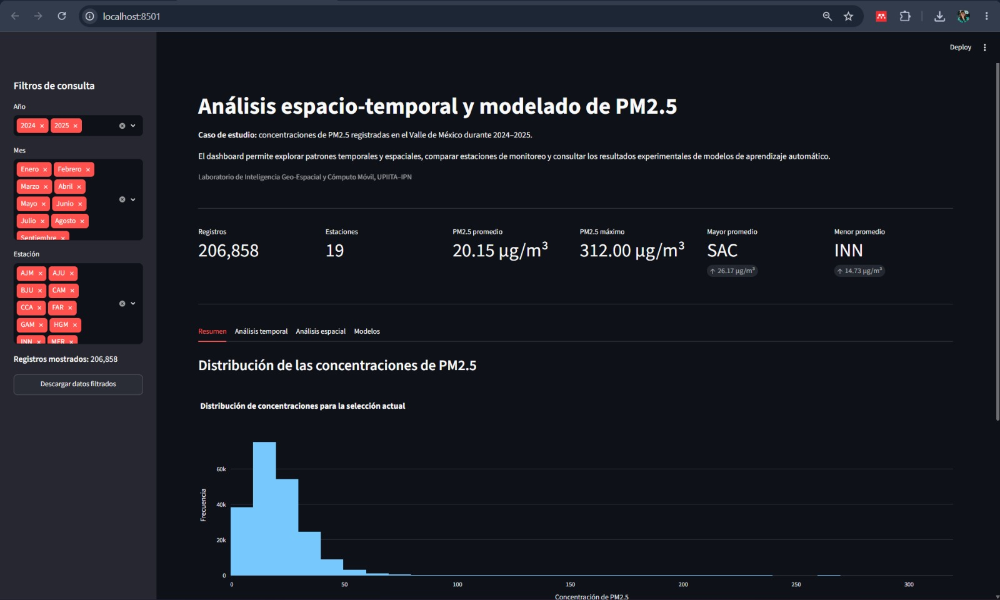

# Análisis espacio-temporal y modelado de PM2.5 en el Valle de México

Prototipo interactivo para la exploración de concentraciones de material
particulado fino PM2.5 registradas durante 2024 y 2025.



## Descripción

Este proyecto integra datos de calidad del aire y variables
meteorológicas para analizar el comportamiento temporal y espacial de
las concentraciones de PM2.5 en el Valle de México.

Como producto técnico se desarrolló un dashboard interactivo en
Streamlit que permite consultar indicadores, aplicar filtros, comparar
estaciones de monitoreo y visualizar los resultados experimentales de
modelos de aprendizaje automático.

## Objetivo

Desarrollar un prototipo interactivo que facilite el análisis
espacio-temporal de las concentraciones de PM2.5 y la consulta de los
resultados obtenidos mediante modelos experimentales de regresión y
clasificación.

## Caso de estudio

**Calidad del aire, exposición humana y variables meteorológicas en la
Ciudad de México.**

## Funcionalidades del dashboard

- Filtros por año, mes y estación de monitoreo.
- Indicadores dinámicos de registros, estaciones y concentraciones.
- Distribución y estadísticas descriptivas de PM2.5.
- Análisis diario, mensual y horario.
- Mapa interactivo de estaciones.
- Ranking de estaciones por concentración promedio.
- Interpretaciones automáticas según los filtros seleccionados.
- Consulta de métricas de regresión y clasificación.
- Explicación de las principales métricas.
- Descarga de los datos filtrados en formato CSV.
- Nota metodológica sobre el carácter experimental de los modelos.

## Flujo de trabajo

1. Validación de los archivos originales.
2. Exploración de las fuentes de información.
3. Limpieza e integración de los datos.
4. Análisis descriptivo y exploratorio.
5. Análisis temporal y espacial.
6. Entrenamiento y evaluación de modelos de regresión.
7. Clasificación exploratoria de episodios elevados.
8. Desarrollo y validación del dashboard.

## Tecnologías utilizadas

- Python
- Jupyter Notebook
- Pandas
- NumPy
- GeoPandas
- Matplotlib
- Plotly
- Scikit-learn
- Streamlit

## Estructura del repositorio

```text
ProyAmbiental/
│
├── app/
│   ├── app.py
│   └── iconoCDMX.png
│
├── notebooks/
│   ├── 01_validacion_datos.ipynb
│   ├── 02_exploracion_datasets.ipynb
│   ├── 03_integracion_datasets.ipynb
│   ├── 04_analisis_exploratorio.ipynb
│   ├── 05_modelado_experimental.ipynb
│   └── 06_clasificacion_episodios_criticos.ipynb
│
├── resultados/
│   ├── tablas/
│   ├── figuras/
│   ├── figuras_modelado/
│   ├── figuras_clasificacion/
│   └── capturas_dashboard/
│
├── .streamlit/
│   └── config.toml
│
├── .gitignore
├── README.md
├── RESULTADOS_TECNICOS.md
└── requirements.txt
```

## Datos

Los archivos originales y las bases geográficas de gran tamaño no se
incluyen en el repositorio debido a sus dimensiones.

El repositorio conserva el dataset procesado que necesita el dashboard:

```text
resultados/dataset_analisis_pm25_2024_2025.csv
```

También incluye las tablas de métricas utilizadas por la aplicación:

```text
resultados/tablas/metricas_modelos_regresion.csv
resultados/tablas/metricas_clasificacion_episodios.csv
```

## Instalación

### 1. Clonar el repositorio

```bash
git clone URL_DEL_REPOSITORIO
```

Después entra a la carpeta:

```bash
cd ProyAmbiental
```

> Sustituir `URL_DEL_REPOSITORIO` por la dirección real del repositorio
> de GitHub.

### 2. Crear un entorno virtual

```bash
python -m venv .venv
```

### 3. Activar el entorno en Windows PowerShell

```powershell
.\.venv\Scripts\Activate.ps1
```

Si PowerShell bloquea temporalmente la activación, ejecutar:

```powershell
Set-ExecutionPolicy -Scope Process -ExecutionPolicy RemoteSigned
```

Después volver a activar el entorno:

```powershell
.\.venv\Scripts\Activate.ps1
```

### 4. Instalar las dependencias

```bash
python -m pip install -r requirements.txt
```

## Ejecución del dashboard

Desde la raíz del proyecto, ejecutar:

```bash
python -m streamlit run app/app.py
```

La aplicación estará disponible normalmente en:

```text
http://localhost:8501
```

## Resultados principales

### Regresión

Entre los modelos evaluados, Random Forest obtuvo el mejor desempeño
general:

- MAE aproximado: 7.31
- RMSE aproximado: 9.86
- R² aproximado: 0.283

Aunque superó a la regresión lineal y al modelo Dummy, su capacidad
explicativa fue moderada.

### Clasificación

El Random Forest Classifier obtuvo aproximadamente:

- Accuracy: 0.9045
- Precision: 0.331
- Recall: 0.332
- F1: 0.332
- ROC-AUC: 0.796
- PR-AUC: 0.277

La regresión logística alcanzó un recall aproximado de 0.747, pero con
una precision menor, cercana a 0.146. Esto indica una mayor detección de
episodios elevados, acompañada de una mayor cantidad de falsas alarmas.

## Consideraciones metodológicas

Los modelos fueron entrenados con datos de 2024 y evaluados con
registros de 2025.

El percentil 90 utilizado para definir episodios elevados tiene un
propósito exploratorio y académico. No representa un criterio normativo
oficial de calidad del aire.

## Limitaciones

- La disponibilidad de datos no fue uniforme entre las estaciones.
- Los registros faltantes pueden afectar los promedios.
- El mapa representa estaciones y no una superficie continua de
  contaminación.
- El modelo de regresión presentó una capacidad explicativa moderada.
- Los episodios elevados representan una clase minoritaria.
- Los resultados no sustituyen sistemas oficiales de monitoreo,
  pronóstico o evaluación.

## Equipo

- **Miranda Patricia Pérez Camelo:** Responsable Técnica.
- **Ana:** Responsable de Datos.
- **Fer:** Responsable de Comunicación Científica.

## Instituciones

- Programa Interinstitucional para el Fortalecimiento de la
  Investigación y el Posgrado del Pacífico, Programa DELFÍN 2026.
- Instituto Politécnico Nacional.
- Unidad Profesional Interdisciplinaria de Ingeniería y Tecnologías
  Avanzadas.
- Laboratorio de Inteligencia Geo-Espacial y Cómputo Móvil.

## Estado del proyecto

El repositorio contiene un prototipo académico y experimental
desarrollado con fines de investigación y comunicación científica.